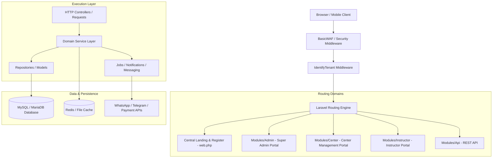

# 07_ARCHITECTURE - System Architecture & Patterns

---

## Architectural Principles

1. **Single-Database Multi-Tenancy Architecture**: All tenant-owned records contain a `tenant_id` foreign key. The `BelongsToTenant` trait automatically injects a global Eloquent scope (`TenantScope`).
2. **Service Layer Separation**: Controllers validate input and delegate execution to domain Service classes (`app/Services/`).
3. **Modular Monolith Pattern**: High-level domain contexts are isolated into standalone modules (`Modules/*`).
