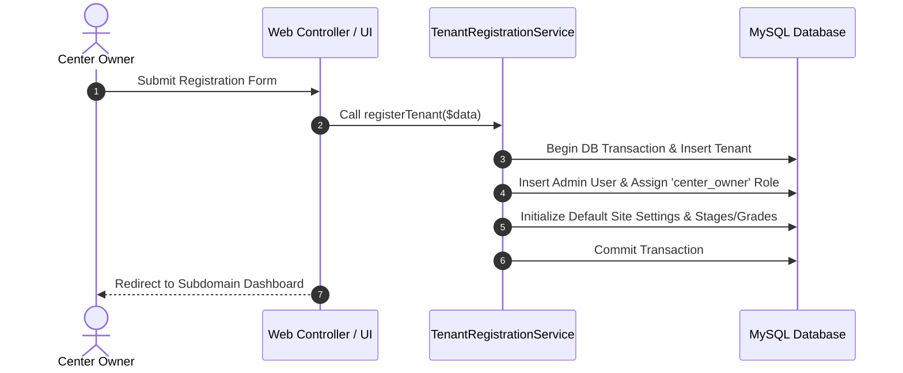

# 17_BUSINESS_LOGIC - Core Domain Rules & Diagrams

### Domain Rules
- **Multi-Tenant Scoping**: All queries auto-filtered by `tenant_id`.
- **Financial Transactions**: Invoices, sales, and payments must be wrapped in DB transactions.
- **Attendance Alerts**: Absent/Late attendance automatically triggers background WhatsApp notifications to parents.
